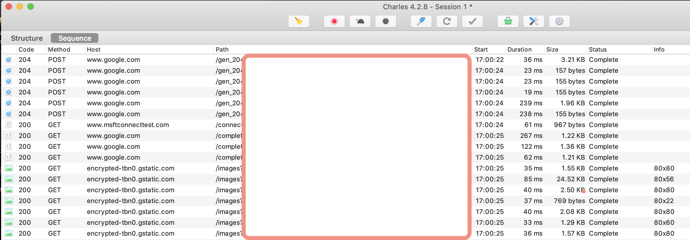
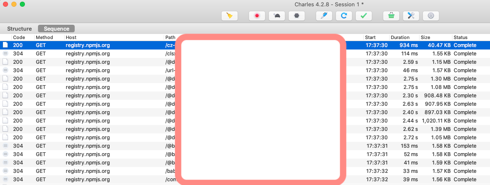

# Charles 監聽 Command line tool 封包 (MacOS為例)

開始前先至 [Charles官網下載程式](https://www.charlesproxy.com/download/latest-release/)
## Install Charles Proxy Server Certificate & Proxy Setting

- `Help` -> `SSL Proxying` -> `SSL Proxying` -> `Install Charles Root Certificate`

安裝完後後至 Keychain 點選信任憑證

- `Proxy` -> `Proxy Settings` -> `Port: 8888` 
-> :heavy_check_mark: Enable transparent HTTP proxying

- `Proxy` -> `Proxy Settings` -> :heavy_check_mark:`macOS Proxy`

完成此步驟後便可監聽基本瀏覽器的 HTTP/HTTPS 封包



## 監聽不到 Command line tool ?!

這時候發現在 Terminal 下的 command line tool 都無法被監聽到，以 npm 為例

1. 先下載 [Charles的pem certificate](http://chls.pro/ssl)
2. 找到 cli 的 proxy 設定方式，例如 npm 的設定方式如下
```sh
npm config set proxy http://192.168.2.2:8888 // 你的本機IP，proxy server設定的port號
npm config set https-proxy http://192.168.2.2:8888 // 你的本機IP，proxy server設定的port號
```


暫時讓node信任 Charles 憑證，直接輸入只會暫存在工作區，關掉 terminal 後失效，也可以放入bash profile
```sh
export NODE_EXTRA_CA_CERTS=/你的/Charles/下載後放的路徑/charles-proxy-ssl-proxying-certificate.pem
```


可以開始看到 npm 的封包囉




結束後可以把npm proxy給設置回去
```sh
npm config rm proxy
npm config rm https-proxy


// 確認是否已清掉 proxy 設定
npm config get proxy
npm config get https-proxy
```