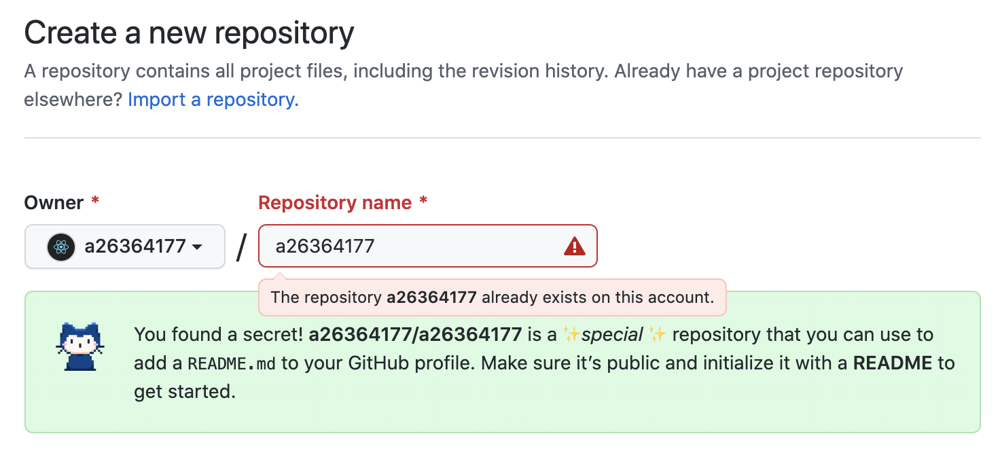
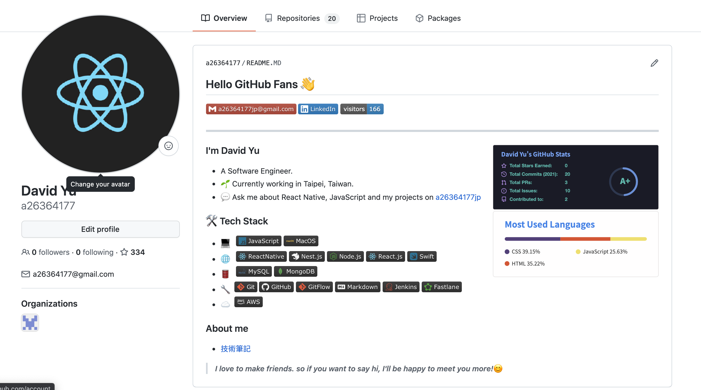

# 美化個人 GitHub profile
***

常常看到許多大佬的GitHub profile非常精美而產生了也來美化一下自己的profile的想法

## 建立repo for readme profile

- GitHub 從某版開始支援在開個相容帳號名的 repo，會將 repo 內的 README.md 檔案顯示在 profile 頁面的功能
- 先開個自己帳號名的repo並新增README.MD檔案，此時會提示
> You found a secret! a26364177/a26364177 is a ✨special ✨ repository that you can use to add a README.md to your GitHub profile. Make sure it’s public and initialize it with a README to get started.


(我的帳號已經創了此 repo，所以會跳紅色警告，可無視)

- 開始修改 README.MD 檔案即可更新 profile 顯示區塊


## 第三方美化工具
***

### 統計工具 [anuraghazra/github-readme-stats](https://github.com/anuraghazra/github-readme-stats)

- 把 username 改成自己的GitHub username，其他參數調整可參考 [README](https://github.com/anuraghazra/github-readme-stats)
```

```


### 各種profile模板 [kautukkundan/Awesome-Profile-README-templates](https://github.com/kautukkundan/Awesome-Profile-README-templates/tree/master/elaborate)

我是參考這個[JoeyBling.md](https://github.com/kautukkundan/Awesome-Profile-README-templates/blob/master/elaborate/JoeyBling.md)改的

### 統計頁面訪客數 badge工具 [visitor-badge](https://visitor-badge.laobi.icu/)

- 一個可用在 Markdown 上的簡易統計次數小工具，可以自己修改page_id參數(F5會重複計算)

```

```


### Markdown Badge工具 [shields-io](https://shields.io/)
- 可從這邊製作出常用的 Markdown Badge
- icon name 可從此參考 [Simple Icon](https://simpleicons.org/?q=jenkins)
```
[](mailto:joeysiwei@gmail.com)
[](https://www.linkedin.com/in/david-yu-23a3a314b/)
```
[](mailto:joeysiwei@gmail.com)
[](https://www.linkedin.com/in/david-yu-23a3a314b/)

## 成果
***


[https://github.com/a26364177/a26364177/blob/main/README.MD](https://github.com/a26364177/a26364177/blob/main/README.MD)